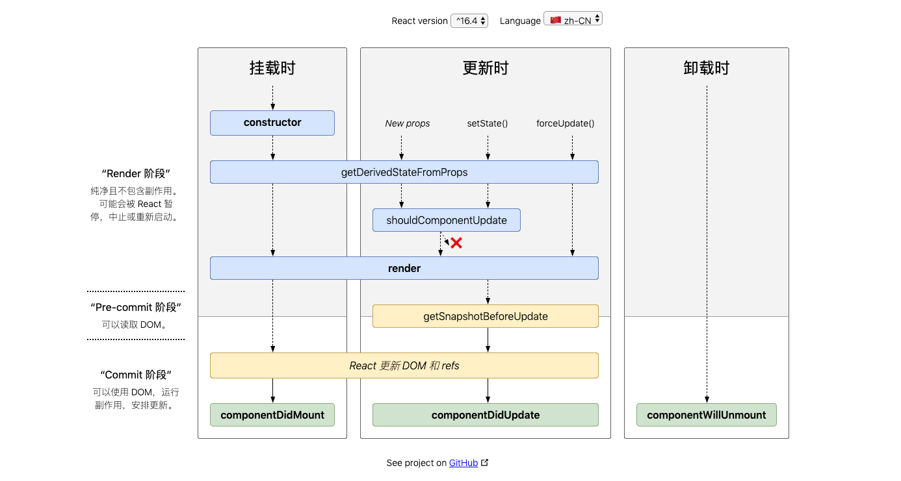

## React生命周期和反模式




在React 16.4之后 引入fiber架构有些生命周期会慢慢淘汰掉

#### 预废弃

- componentWillMount
- componentWillUpdate
- componentWillReceiveProps

#### 已新增
- getDerivedStateFromProps
- getSnapshotBeforeUpdate
- UNSAFE_componentWillMount 
- UNSAFE_componentWillReceiveProps 
- UNSAFE_componentWillUpdate
  

目前新增了三个生命周期，其实也就是在预废弃的周期函数前加一个USAFE_前缀。


在React 16.4之前，React的渲染机制遵循同步渲染: 
-  首次渲染: willMount > render > didMount， 
-  props更新时: receiveProps > shouldUpdate > willUpdate > render > didUpdate 
-  state更新时: shouldUpdate > willUpdate > render > didUpdate 
- 卸载时: willUnmount
从React 17 开始，渲染机制将会发生颠覆性改变，这个新方式就是 **Async Render**。


首先，async render不是那种服务端渲染，比如发异步请求到后台返回newState甚至新的html，这里的async render还是限制在React作为一个View框架的View层本身。

预废弃的三个生命周期函数都发生在虚拟dom的构建期间，也就是真正的commit更新且进行绘制之前，在将来的React 17中，在dom真正render之前，React中的调度机制可能会不定期的去查看有没有更高优先级的任务，如果有，就打断当前的周期执行函数(哪怕已经执行了一半)，等高优先级任务完成，再回来重新执行之前被打断的周期函数。这种新机制对现存周期函数的影响就是它们的调用时机变的复杂而不可预测，这也就是为什么”UNSAFE”。


## static getDerivedStateFromProps(props, state)

它是作为componentWillReceiveProps的代替品出现，而在React 16 之前componentWillReceiveProps是一个最容易被滥用(misuse)的周期函数。

这个生命周期一般被用来更新组件的状态，或者在组件的属性发生变化时做一些处理逻辑,从而避免掉一次额外的render。

```
static getDerivedStateFromProps(props, state)
```

getDerivedStateFromProps在调用render方法之前调用，包括初始mount和后续更新。它应返回一个对象来更新状态，或者返回null以不更新任何内容.

####  调用时机差异
getDerivedStateFromProps更全能，无论是mounting还是updating都会被触发。componentWillReceiveProps只会updating阶段，并且是父组件触发的render才被调用。

#### derived state

由于组件的props改变而引发了state改变，这个state就是derived state. derived from props.  

####  static

这个方法是静态的，不能访问到组件的实例，无法在方法中使用this。

## 什么时候使用Derived State

```getDerivedStateFromProps``` 这个静态方法使组件能够根据props的更改来更新其内部状态。但是经常会不恰当的使用该方法，会导致组件频繁的更新。

总结起来有两点

- 无条件的根据props来更新state
- 在props和state不匹配的时候更新state


## 例子

下面的组件接受一个prop---一系列的items，根据用户输入的查询条件渲染items，我们使用derived state来存储过滤出的list.

```
class Example extends Component {
  state = {
    filterText: "",
  };

  // *******************************************************
  // NOTE: this example is NOT the recommended approach.
  // See the examples below for our recommendations instead.
  // *******************************************************

  static getDerivedStateFromProps(props, state) {
    // Re-run the filter whenever the list array or filter text change.
    // Note we need to store prevPropsList and prevFilterText to detect changes.
    if (
      props.list !== state.prevPropsList ||
      state.prevFilterText !== state.filterText
    ) {
      return {
        prevPropsList: props.list,
        prevFilterText: state.filterText,
        filteredList: props.list.filter(item => item.text.includes(state.filterText))
      };
    }
    return null;
  }

  handleChange = event => {
    this.setState({ filterText: event.target.value });
  };

  render() {
    return (
      <Fragment>
        <input onChange={this.handleChange} value={this.state.filterText} />
        <ul>{this.state.filteredList.map(item => <li key={item.id}>{item.text}</li>)}</ul>
      </Fragment>
    );
  }
}
```

这种实现方式避免了不必要的重复计算，但是比较复杂，必须分开跟踪props和state变化来保证得到正确的filteredList.

在这个例子中，我们可以使用PureComponent，将过滤逻辑放在render方法中

```
class Example extends PureComponent {
  // State only needs to hold the current filter text value:
  state = {
    filterText: ""
  };

  handleChange = event => {
    this.setState({ filterText: event.target.value });
  };

  render() {
    // The render method on this PureComponent is called only if
    // props.list or state.filterText has changed.
    const filteredList = this.props.list.filter(
      item => item.text.includes(this.state.filterText)
    )

    return (
      <Fragment>
        <input onChange={this.handleChange} value={this.state.filterText} />
        <ul>{filteredList.map(item => <li key={item.id}>{item.text}</li>)}</ul>
      </Fragment>
    );
  }
}
```

看起来清晰简单了很多，但是也不够好，如果列表项很大的话可能会比较耗时，而且如果其他props发生变化，PureComponent可能不会阻止rerender。

我们可以使用memoization

```
import memoize from "memoize-one";

class Example extends Component {
  // State only needs to hold the current filter text value:
  state = { filterText: "" };

  // Re-run the filter whenever the list array or filter text changes:
  filter = memoize(
    (list, filterText) => list.filter(item => item.text.includes(filterText))
  );

  handleChange = event => {
    this.setState({ filterText: event.target.value });
  };

  render() {
    // Calculate the latest filtered list. If these arguments haven't changed
    // since the last render, `memoize-one` will reuse the last return value.
    const filteredList = this.filter(this.props.list, this.state.filterText);

    return (
      <Fragment>
        <input onChange={this.handleChange} value={this.state.filterText} />
        <ul>{filteredList.map(item => <li key={item.id}>{item.text}</li>)}</ul>
      </Fragment>
    );
  }
}
```


## 使用Derived State是常见的错误


