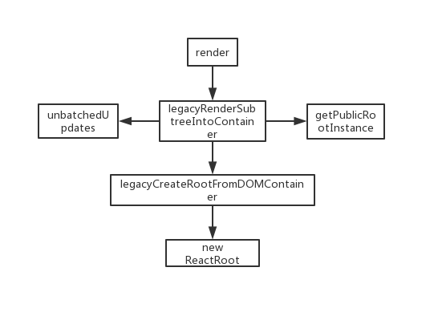

## ReactDOM.render

在React应用中入口便是调用ReactDOM.render方法
例如
```
ReactDOM.render(<App />, mountNode);
```
整个流程如下

;

```

render(
    element: React$Element<any>,
    container: DOMContainer,
    callback: ?Function,
  ) {
    invariant(
      isValidContainer(container),
      'Target container is not a DOM element.',
    );
    return legacyRenderSubtreeIntoContainer(
      null,
      element,
      container,
      false,
      callback,
    );
  },
```
可以看到render方法有三个参数，第一个就是我们的应用，第二个是应用要挂在的根节点，第三个是callback，将会在整个应用render之后进行调用。


#### legacyRenderSubtreeIntoContainer
在legacyRenderSubtreeIntoContainer中调用legacyCreateRootFromDOMContainer获得了ReactRoot的实例root，然后调用unbatchedUpdates,其中的回调函数中调用了root.render方法。


root.render(children, callback);,其中children是ReactDOM.render的第一个参数，是个ReactElement, root.render 是定义在ReactRoot的原型上的，后面会介绍。

```
function legacyRenderSubtreeIntoContainer(
  parentComponent: ?React$Component<any, any>,
  children: ReactNodeList,
  container: DOMContainer,
  forceHydrate: boolean,
  callback: ?Function,
) {
  if (__DEV__) {
    topLevelUpdateWarnings(container);
  }

  // TODO: Without `any` type, Flow says "Property cannot be accessed on any
  // member of intersection type." Whyyyyyy.
  let root: Root = (container._reactRootContainer: any);
  if (!root) {
    // Initial mount
    root = container._reactRootContainer = legacyCreateRootFromDOMContainer(
      container,
      forceHydrate,
    );
    if (typeof callback === 'function') {
      const originalCallback = callback;
      callback = function() {
        const instance = getPublicRootInstance(root._internalRoot);
        originalCallback.call(instance);
      };
    }
    // Initial mount should not be batched.
    unbatchedUpdates(() => {
      if (parentComponent != null) {
        root.legacy_renderSubtreeIntoContainer(
          parentComponent,
          children,
          callback,
        );
      } else {
        root.render(children, callback);
      }
    });
  } else {
    if (typeof callback === 'function') {
      const originalCallback = callback;
      callback = function() {
        const instance = getPublicRootInstance(root._internalRoot);
        originalCallback.call(instance);
      };
    }
    // Update
    if (parentComponent != null) {
      root.legacy_renderSubtreeIntoContainer(
        parentComponent,
        children,
        callback,
      );
    } else {
      root.render(children, callback);
    }
  }
  return getPublicRootInstance(root._internalRoot);
}

```

legacyCreateRootFromDOMContainer 这个方法会删除container内部的子元素，也就是id为root的节点的内容，我们在root节点内提前写入的任何内容都会被删除。同时创建ReactRoot对象。

```
 while (rootSibling = container.lastChild) {
      container.removeChild(rootSibling);
    }
```


