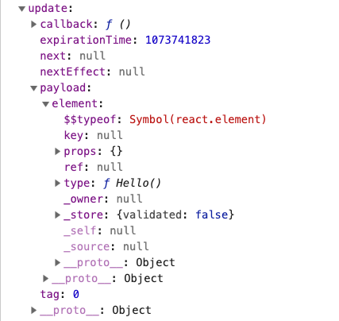

## scheduleRootUpdate
scheduleRootUpdate  这个函数主要执行了两个操作  1个是创建更新createUpdate并放到更新队列enqueueUpdate， 1个是执行sheculeWork函数


```
function scheduleRootUpdate(
  current: Fiber,
  element: ReactNodeList,
  expirationTime: ExpirationTime,
  callback: ?Function,
) {

  const update = createUpdate(expirationTime);
  // Caution: React DevTools currently depends on this property
  // being called "element".
  update.payload = {element};

  callback = callback === undefined ? null : callback;
  if (callback !== null) {
    update.callback = callback;
  }

  flushPassiveEffects();
  enqueueUpdate(current, update);
  scheduleWork(current, expirationTime);

  return expirationTime;
}
```

先看createUpdate函数分析， 它直接返回了一个包含了更新信息的对象

```
function createUpdate(expirationTime) {
  return {
    // 优先级
    expirationTime: expirationTime,
    // 更新类型
    tag: UpdateState,
    // 更新的对象
    payload: null,
    callback: null,
    // 指向下一个更新
    next: null,
    // 指向下一个更新effect
    nextEffect: null
  };
}
```



可以看到payload就是我们应用对应的ReactElement。type就是构造函数

## enqueueUpdate

调用enqueueUpdate把上述的Update加入到HostRoot的updateQueue ， 这个方法会在setState中再作介绍。

接下来就是scheduleWork了，它是render阶段真正的开始。在开始之前有必要介绍一些其他知识，比如全局变量，expirationTime等


